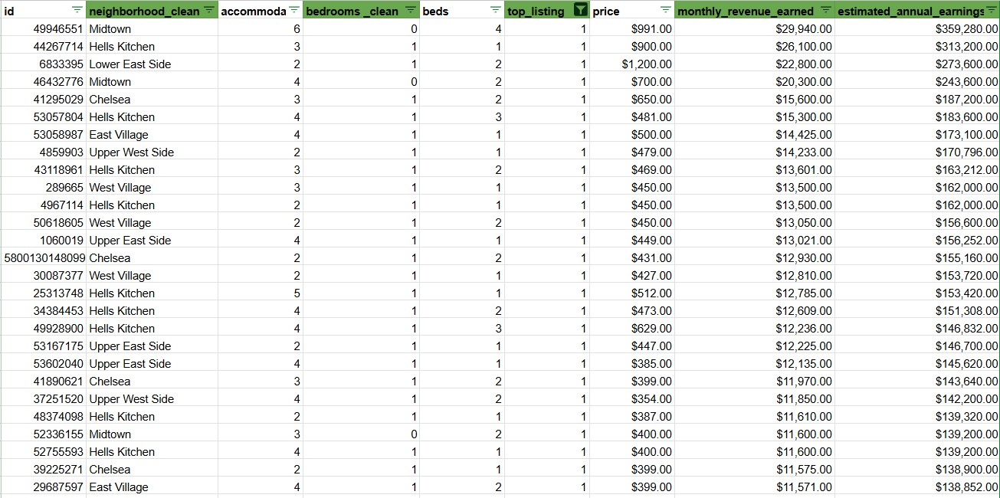

# 🏙️ Airbnb Manhattan Market Analysis – Excel / Google Sheets

## 🚀 Overview  
This project analyzes Airbnb listing data to help a client identify the **best neighborhoods and property sizes** for investment. It combines review activity (as a proxy for demand) and revenue projections to support data-informed real estate decisions.

## 🔍 Objective  
To determine which **neighborhoods and bedroom sizes** are most attractive for short-term rentals and estimate the **potential annual revenue** of the top listings using pricing and availability data.

## 🛠️ Tools & Techniques  
- **Excel / Google Sheets** – Pivot tables, filters, SUMIFs, VLOOKUPs, and formula-based modeling  
- **Data Segmentation** – By neighborhood, property type, and review count  
- **Revenue Modeling** – Estimating annual income using 30-day sample data  
- **Business Logic** – Flagging high-performing listings based on location + bedroom type

---

## 📸 Dashboard Previews

### 🔹 Top Neighborhoods by Demand  
**Metric:** Total reviews in the last 12 months  
*Used review volume as a proxy for occupancy/demand.*

---

### 🔹 Popular Property Sizes  
**Metric:** Count of listings by bedroom count  
*Identified which property sizes were most common in high-demand areas.*

---

### 🔹 Neighborhood vs. Preferred Property Size  
*Mapped bedroom size preferences per neighborhood to guide tailored investment decisions.*

---

### 🔹 Estimated Monthly & Annual Revenue  
**Metric:** Revenue earned (30-day actual x 12)  
*Calculated revenue projections for listings that matched high-performance criteria.*

---

## 📈 Key Insights  
- **1-bedroom units** were the most in-demand property type in nearly all top neighborhoods, except Midtown (where studios led)  
- Listings with the highest review volumes also tended to have higher prices and stronger revenue potential  
- Top listings had estimated annual earnings exceeding **$359,280**, making them strong candidates for investment

---

## 📂 Files & Resources  
- 📄 [View the Full Google Sheet](https://docs.google.com/spreadsheets/d/1H0SVDkSAdtrKmhV0Ld5_v5qJ1jB6mIgXA9Sl6eE9c2s/edit?usp=sharing) – Includes all pivot tables, formulas, and data modeling
- `visuals/`: All screenshots used in this README  
- `README.md`: Full project documentation 

---

## ✅ Conclusion  
By combining demand indicators (reviews) with pricing and availability data, this analysis provides a clear framework for identifying **profitable Airbnb investment opportunities** in Manhattan. Insights are presented visually and supported with data-backed revenue modeling.

